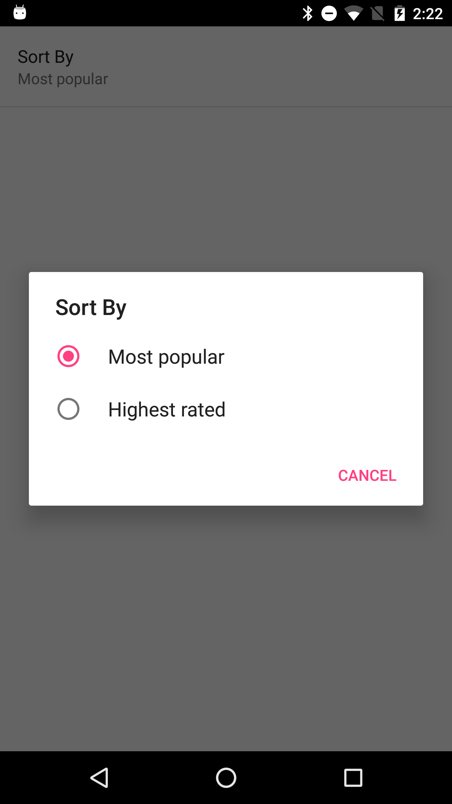
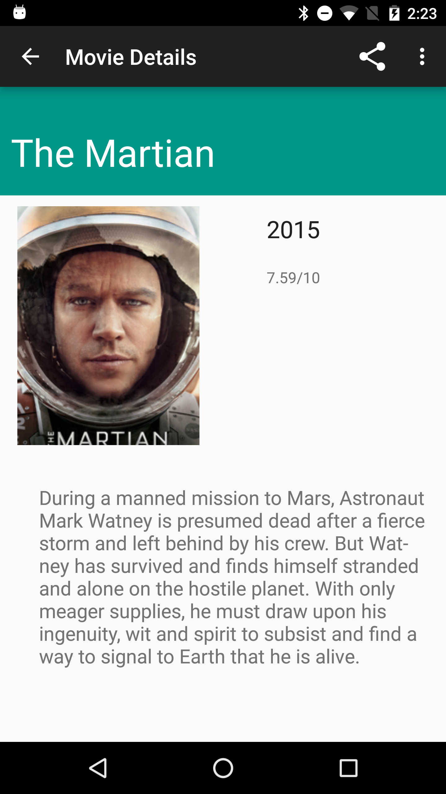
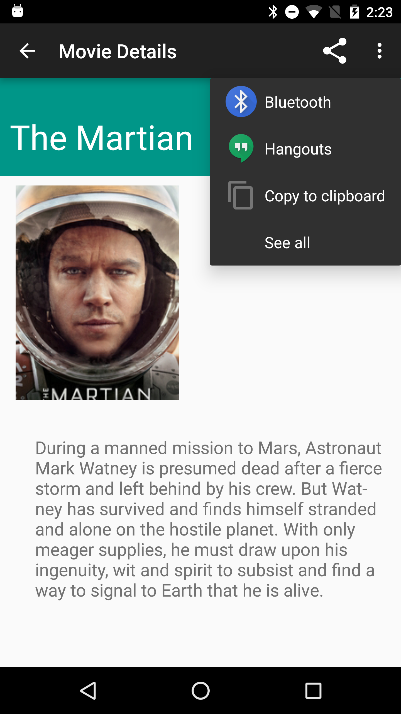

# Popular Movies App, Stage 1

Stage 1 of Popular Movies app required to complete Udacity’s Android Developer Nanodegree. This is an MVP that provides core experience of a movie search app. 

### User Experience

1. Upon launch, present movie posters in a Grid view (screenshot 1)
2. Allow user to change sort criteria through Settings menu (screenshot 2)
3. Allow user to navigate to view movie details (screenshot 3)
4. Allow user to share a movie with another app (screenshot 4)

### Screenshots






### Change API Key
In order to run the app, you must create your own Movie DB API key. See [here](https://www.themoviedb.org/documentation/api?language=en) for more info. Once you have crated an API key, insert the same in com.udacity.popularmovies.stageone.util.Constants.java file.   
 


```
 public static final String MOVIE_DB_API_KEY = "YOUR_API_KEY";

```

### Libraries

This project demonstartes the use of following libraries:

1. [Retrofit](http://square.github.io/retrofit/)- HTTP client library used for making network calls
2. Butterknife- used for view injection
3. Otto- an event bus
4. Picasso- an image loading and caching library

### Support

If you've found an error in this sample, please file an issue:

https://github.com/kunal-jaggi/PopularMoviesStage1/issues