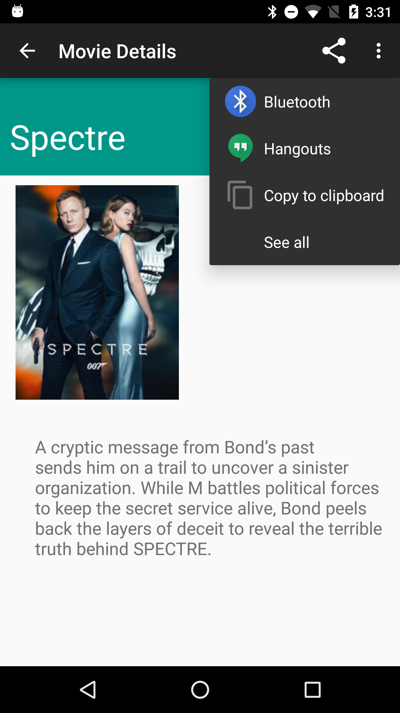

# Android M Permissions and Forward Compatibility for Legacy Apps

An example app to demo the new runtime permission model introduced in Android M 

### Introduction

MyContacts app will query the ContactsProvider component to retrieve all stored contacts. It needs READ_CONTACTS Permission. Although this app is designed for pre M devices, but we will install it on an Android M virtual device. On Android M, you can turn off app permissions from the settings screen (see screenshot 3). This will not cause our app to crash or throw SecurityException. You will notice how Android M will return an empty data set with no contacts (see screenshot 4). You can read more about it on the
[Android Advocate
blog](http://android-advocate.blogspot.com/2015/06/android-m-permissions-and-forward.html).

### Screenshots




### Getting Started

Clone this repository, enter the top level directory and run <code>./gradlew tasks</code> to get an overview of all the tasks available for this project.

Some important tasks are:

```
assembleDebug - Assembles all Debug builds.
installDebug - Installs the Debug build.
```

### Download Android M Developer Preview
To test revoking app permissions at runtime, you will need Android M Developer preview SDK Manager. You can download the M preview SDK from the following link
http://developer.android.com/preview/index.html      

### Support

If you've found an error in this sample, please file an issue:

https://github.com/kunal-jaggi/android-m-permissions-forward/issues